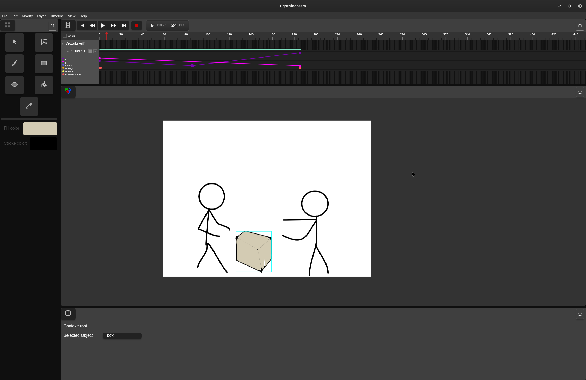
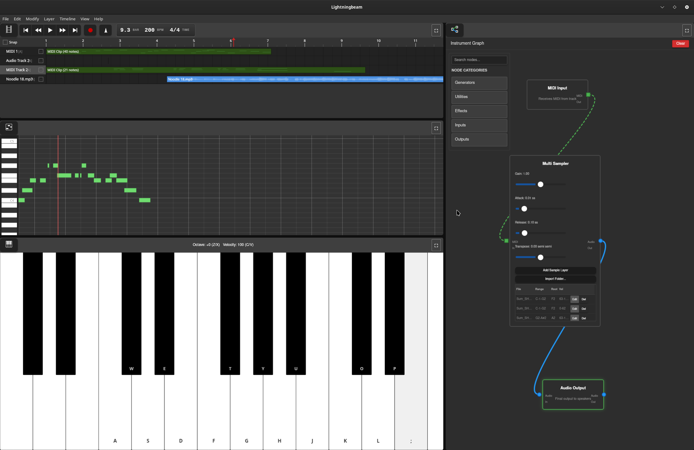
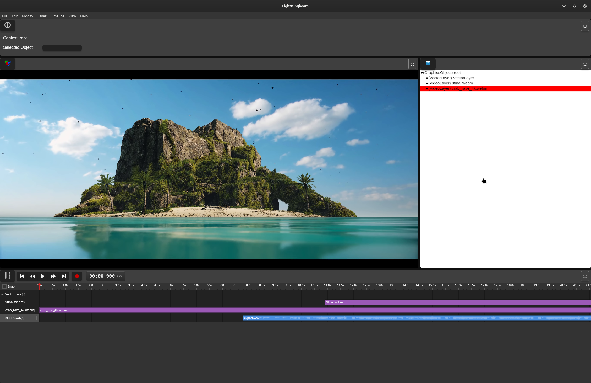

# Lightningbeam

A free and open-source 2D multimedia editor combining vector animation, audio production, and video editing in a single application.

## Screenshots

## Current Features

**Vector Animation**
- Draw and animate vector shapes with keyframe-based timeline
- Non-destructive editing workflow

**Audio Production**
- Multi-track audio recording
- MIDI sequencing with synthesized and sampled instruments
- Integrated DAW functionality

**Video Editing**
- Basic video timeline and editing (early stage)
- FFmpeg-based video decoding

## Technical Stack

- **Frontend:** Vanilla JavaScript
- **Backend:** Rust (Tauri framework)
- **Audio:** cpal + dasp for audio processing
- **Video:** FFmpeg for encode/decode

## Project Status

Lightningbeam is under active development. Current focus is on core functionality and architecture. Full project export is not yet fully implemented.

### Known Architectural Challenge

The current Tauri implementation hits IPC bandwidth limitations when streaming decoded video frames from Rust to JavaScript. Tauri's IPC layer has significant serialization overhead (~few MB/s), which is insufficient for real-time high-resolution video rendering.

I'm currently exploring a full Rust rewrite using wgpu/egui to eliminate the IPC bottleneck and handle rendering entirely in native code.

## Project History

Lightningbeam evolved from earlier multimedia editing projects I've worked on since 2010, including the FreeJam DAW. The current JavaScript/Tauri iteration began in November 2023.

## Goals

Create a comprehensive FOSS alternative for 2D-focused multimedia work, integrating animation, audio, and video editing in a unified workflow.