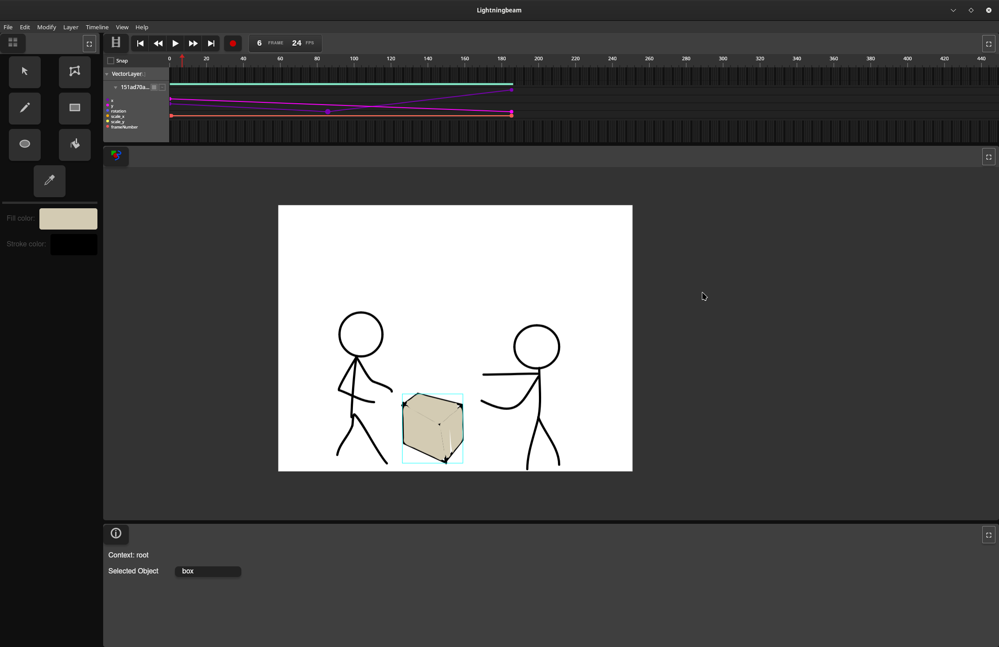
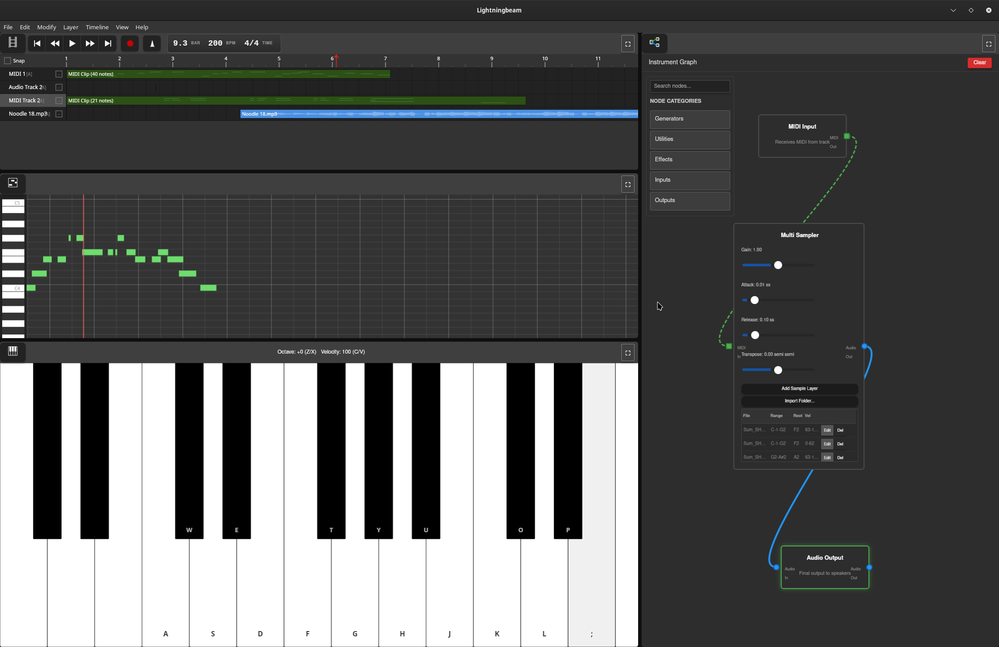
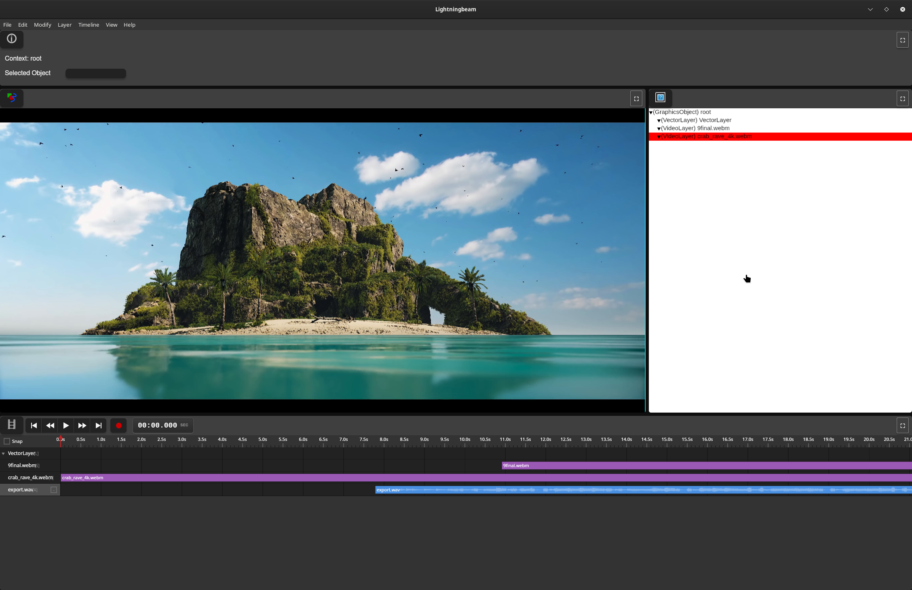

# Lightningbeam

A free and open-source 2D multimedia editor combining vector animation, audio production, and video editing in a single application.

## Screenshots







## Features

**Vector Animation**
- GPU-accelerated vector rendering with Vello
- Draw and animate vector shapes with keyframe-based timeline
- Non-destructive editing workflow
- Paint bucket tool for automatic fill detection

**Audio Production**
- Real-time multi-track audio recording and playback
- Node graph-based effects processing
- MIDI sequencing with synthesizers and samplers
- Comprehensive effects library (reverb, delay, EQ, compression, distortion, etc.)
- Custom audio engine with lock-free design for glitch-free playback

**Video Editing**
- Video timeline and editing with FFmpeg-based decoding
- GPU-accelerated waveform rendering with mipmaps
- Audio integration from video soundtracks

## Technical Stack

**Current Implementation (Rust UI)**
- **UI Framework:** egui (immediate-mode GUI)
- **GPU Rendering:** Vello + wgpu (Vulkan/Metal/DirectX 12)
- **Audio Engine:** Custom real-time engine (`daw-backend`)
  - cpal for cross-platform audio I/O
  - symphonia for audio decoding
  - dasp for node graph processing
- **Video:** FFmpeg 8 for encode/decode
- **Platform:** Cross-platform (Linux, macOS, Windows)

**Legacy Implementation (Deprecated)**
- Frontend: Vanilla JavaScript
- Backend: Rust (Tauri framework)

## Project Status

Lightningbeam is developed on the `main` branch. The project has been rewritten from a Tauri/JavaScript prototype to a pure Rust application to eliminate IPC bottlenecks and achieve better performance for real-time video and audio processing.

**Current Status:**
- ✅ Core UI panes (Stage, Timeline, Asset Library, Info Panel, Toolbar)
- ✅ Drawing tools (Select, Draw, Rectangle, Ellipse, Paint Bucket, Transform)
- ✅ Undo/redo system
- ✅ GPU-accelerated vector rendering
- ✅ Audio engine with node graph processing
- ✅ GPU waveform rendering with mipmaps
- ✅ Video decoding integration
- 🚧 Export system (in progress)
- 🚧 Node editor UI (planned)
- 🚧 Piano roll editor (planned)

## Getting Started

### Prerequisites

- Rust (stable toolchain via [rustup](https://rustup.rs/))
- System dependencies:
  - **Linux:** ALSA development files, FFmpeg 8
  - **macOS:** FFmpeg (via Homebrew)
  - **Windows:** FFmpeg 8, Visual Studio with C++ tools

See [docs/BUILDING.md](docs/BUILDING.md) for detailed setup instructions.

### Building and Running

```bash
# Clone the repository
git clone https://github.com/skykooler/lightningbeam.git
# Or from Gitea
git clone https://git.skyler.io/skyler/lightningbeam.git

cd lightningbeam/lightningbeam-ui

# Build and run
cargo run

# Or build optimized release version
cargo build --release
```

### Documentation

- **[CONTRIBUTING.md](CONTRIBUTING.md)** - Development setup and contribution guidelines
- **[ARCHITECTURE.md](ARCHITECTURE.md)** - System architecture overview
- **[docs/BUILDING.md](docs/BUILDING.md)** - Detailed build instructions and troubleshooting
- **[docs/AUDIO_SYSTEM.md](docs/AUDIO_SYSTEM.md)** - Audio engine architecture and development
- **[docs/UI_SYSTEM.md](docs/UI_SYSTEM.md)** - UI pane system and tool development
- **[docs/RENDERING.md](docs/RENDERING.md)** - GPU rendering pipeline and shaders

## Project History

Lightningbeam evolved from earlier multimedia editing projects I've worked on since 2010, including the FreeJam DAW. The JavaScript/Tauri prototype began in November 2023, and the Rust UI rewrite started in late 2024 to eliminate performance bottlenecks and provide a more integrated native experience.

## Goals

Create a comprehensive FOSS alternative for 2D-focused multimedia work, integrating animation, audio, and video editing in a unified workflow. Lightningbeam aims to be:

- **Fast:** GPU-accelerated rendering and real-time audio processing
- **Flexible:** Node graph-based audio routing and modular synthesis
- **Integrated:** Seamless workflow across animation, audio, and video
- **Open:** Free and open-source, built on open standards

## Contributing

Contributions are welcome! Please see [CONTRIBUTING.md](CONTRIBUTING.md) for guidelines.

## License

[License information to be added]

## Links

- **GitHub:** https://github.com/skykooler/lightningbeam
- **Gitea:** https://git.skyler.io/skyler/lightningbeam
